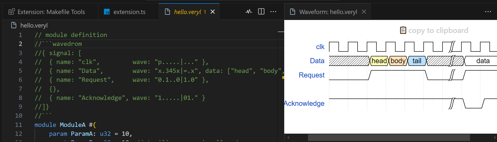

+++
title = "Announcing Veryl 0.16.2"
+++

The Veryl team has published a new release of Veryl, 0.16.2.
Veryl is a new hardware description language as an alternate to SystemVerilog.

If you have a previous version of Veryl installed via `verylup`, you can get the latest version with:

```
$ verylup update
```

If you don't have it already, you can get `verylup` from [release page](https://github.com/veryl-lang/verylup/releases/latest).

# New Language Features

## Support reference to type defiend in existing package via proto package {{ pr(id="1691") }}

Proto typedefs are allowed to have their actual types. This allows a type symbol defined in a different package to be imported into the proto package and referenced from other components through it.

```veryl
package FooPkg {
    struct Foo {
        foo: logic,
    }
}

proto package BarProtoPkg {
    type Foo = FooPkg::Foo;
}

package BarPkg for BarProtoPkg {
    type Foo = FooPkg::Foo;
}

module ModuleA::<PKG: BarProtoPkg> {
    var _foo    : PKG::Foo;
    assign _foo.foo = 0;
}

module ModuleB {
    inst u: ModuleA::<BarPkg>;
}
```

## Add const declarations to StatementBlockItems {{ pr(id="1695") }}

`const` declaration can be used in statement blocks.

```veryl
function foo () -> u32 {
    const bar: u32 = 2;
    return bar;
}
```

## Support embed declaration in component declaration {{ pr(id="1712") }}

`embed` declaration with `sv` block can be used in component declaration like module, interface and package.

```veryl
module ModuleA {
    embed (inline) sv{{{
        initial begin
            $display("hello");
        end
    }}}
}
```

# New Tool Features

## Merge Waveform Render into Veryl VS Code Extension {{ pr(id="1713") }}

VSCode Extension supports preview of waveform in documentation comments.



## Add support for including additional files for tests {{ pr(id="1718") }} {{ pr(id="1729") }}

Additional files for test can be specified by `include_files`. For example, it can be used to specify HEX files which are read by `$readmemh`.

```toml
[test]
include_files = ["test.hex"]
```

## Allow to specify multiple source directories {{ pr(id="1747") }}

Multiple source directories can be specified via `sources` instead of `source`.
`source` becomes deprecated, and will be removed after a few versions.

```toml
[build]
sources = ["rtl", "tb"]
```

# Other Changes

Check out everything that changed in [Release v0.16.2](https://github.com/veryl-lang/veryl/releases/tag/v0.16.2).
