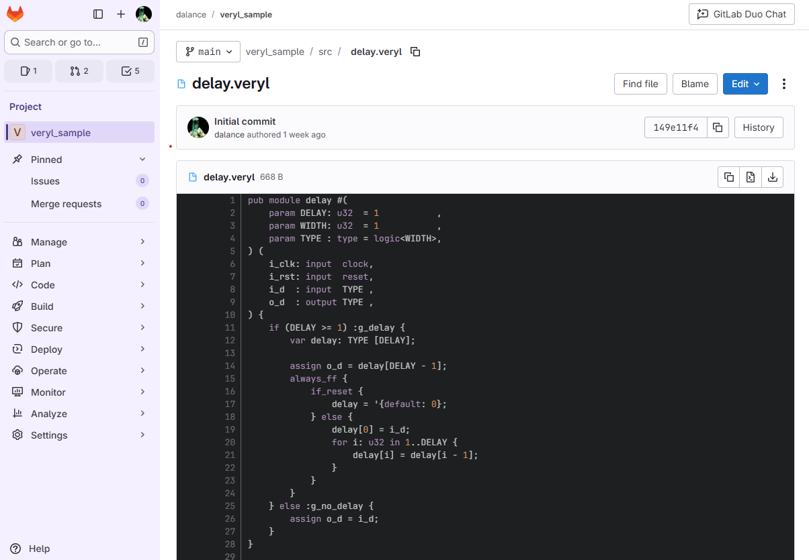

+++
title = "GitLab supports syntax highlighting of Veryl"
+++

Veryl is a new hardware description language as an alternate to SystemVerilog.

GitLab 18.3, which was released at 2025/08/21, includes syntax highlighting support of Veryl.
This feature can be used for on-premise environment, and it was already reflected to [https://gitlab.com](https://gitlab.com).

