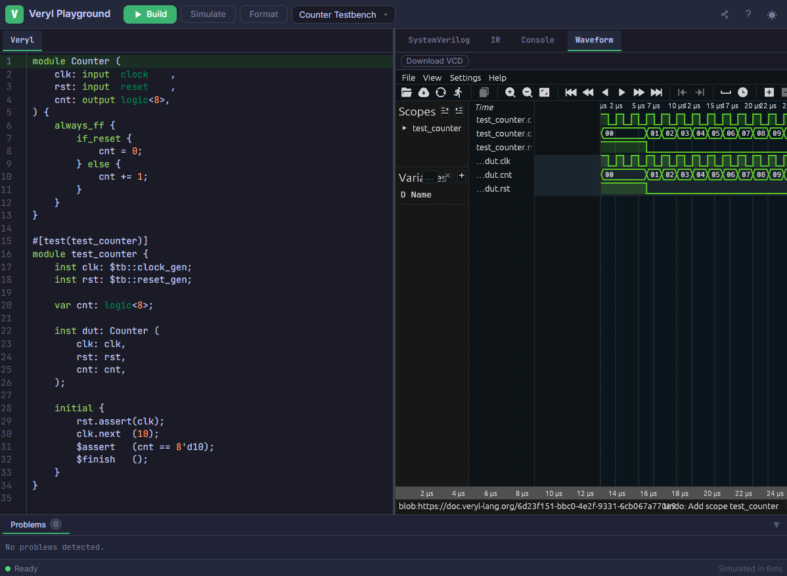

+++
title = "Announcing Veryl 0.19.1"
+++

The Veryl team has published a new release of Veryl, 0.19.1.
Veryl is a new hardware description language as an alternate to SystemVerilog.

If you have a previous version of Veryl installed via `verylup`, you can get the latest version with:

```
$ verylup update
```

If you don't have it already, you can get `verylup` from [release page](https://github.com/veryl-lang/verylup/releases/latest).

# New Language Features

## Infer clock domain {{ pr(id="2400") }}

Variables without explicit clock domain annotation can now be inferred from their context.
For example, when a variable is assigned from a signal with a known clock domain, the variable's domain is automatically inferred.

```veryl
module ModuleA (
    i_clk_a: input  'a clock,
    i_rst_a: input  'a reset,
    i_dat_a: input  'a logic,
    o_dat_a: output 'a logic,
) {
    var x: logic;
    assign x = i_dat_a;   // x is inferred as 'a domain
    assign o_dat_a = x;
}
```

## Support global function {{ pr(id="2366") }}

Functions can now be defined at the project root (outside of `module`, `interface`, and `package`).
Global functions support generic type parameters and public visibility via `pub`.

```veryl
pub function add::<W: u32> (
    a: input logic<W>,
    b: input logic<W>,
) -> logic<W> {
    return a + b;
}

module ModuleA #(
    param WIDTH: u32 = 8,
) (
    i_a: input  logic<WIDTH>,
    i_b: input  logic<WIDTH>,
    o_c: output logic<WIDTH>,
) {
    assign o_c = add::<WIDTH>(i_a, i_b);
}
```

## Allow to specify multiple modports as default modport target {{ pr(id="2306") }}

Multiple modports can now be specified as default modport targets using `..same()` or `..converse()`.

```veryl
interface InterfaceA {
    var a: u32;
    var b: u32;
    modport mp_a { a: input }
    modport mp_b { b: input }
    modport mp_ab {
        ..same(mp_a, mp_b)
    }
}
```

## Copy imported functions from target modports of `same` default member {{ pr(id="2326") }}

When using `..same()` to inherit from another modport, imported functions from the target modport are now automatically copied.

```veryl
interface InterfaceA {
    var a: u32;
    modport mp_a {
        a: input,
        import get_a(),
    }
    modport mp_b {
        ..same(mp_a)   // get_a() is automatically copied
    }
}
```

## Add positive integer types {{ pr(id="2281") }}

New integer types `p8`, `p16`, `p32`, and `p64` are introduced, which restrict values to positive numbers only.

```veryl
module ModuleA {
    const X: p32 = 10;
}
```

# New Tool Features

## Minimal support of Veryl native testbench {{ pr(id="2338") }}

Veryl now supports native testbench syntax. You can write testbenches directly in Veryl using `$tb::clock_gen` and `$tb::reset_gen` for clock and reset generation, and `initial` blocks for test scenarios.

```veryl
#[test(test_counter)]
module test_counter {
    inst clk: $tb::clock_gen;
    inst rst: $tb::reset_gen;

    var cnt: logic<32>;

    inst dut: Counter (
        clk: clk,
        rst: rst,
        cnt: cnt,
    );

    initial {
        rst.assert(clk);
        clk.next  (10);
        $assert   (cnt == 32'd10);
        $finish   ();
    }
}
```

Note that the native simulator used for native tests may still contain bugs. Please use with caution. If you find any bugs, please report them via [GitHub Issues](https://github.com/veryl-lang/veryl/issues).

## Add `#[ignore]` attribute for `#[test]` {{ pr(id="2418") }}

Tests can now be marked with `#[ignore]` to skip them during test execution.

```veryl
#[test(test_counter)]
#[ignore]
module test_counter {
}
```

## Documentation test by WaveDrom {{ pr(id="2363") }}

WaveDrom timing diagrams in documentation comments can now be tested by using the `wavedrom,test` tag. This validates the WaveDrom JSON syntax at build time.

```veryl
/// ```wavedrom,test
/// { "signal": [{ "name": "clk", "wave": "p..." }] }
/// ```
pub module ModuleA {}
```

## Playground improvements

The [Veryl Playground](https://doc.veryl-lang.org/playground/) has been redesigned with the following improvements:



- UI overhaul with dark/light theme support
- Auto-save of code to browser storage
- Shareable link generation
- Simulation with waveform viewer and VCD download

# Other Changes

Check out everything that changed in [Release v0.19.1](https://github.com/veryl-lang/veryl/releases/tag/v0.19.1).
