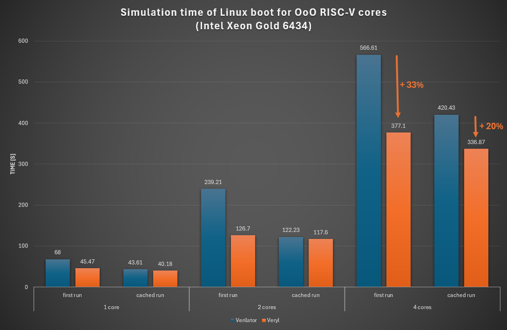
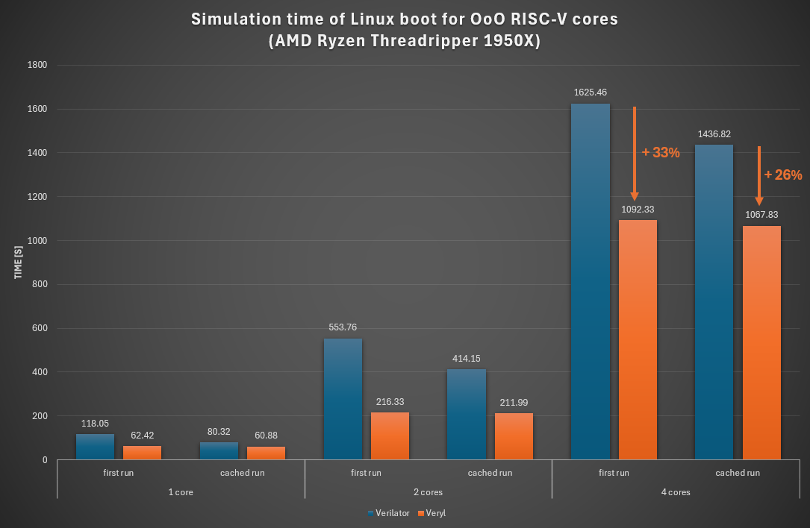

+++
title = "Veryl Simulator: Performance Comparison with Verilator"
+++

We have been working on a native Veryl simulator built on the new IR-based analyzer
introduced earlier this year. This post shares early performance numbers
comparing it against [Verilator](https://www.veripool.org/verilator/), the de facto
standard open source SystemVerilog simulator.

## Approach

The Veryl simulator combines two execution backends:

* A **[Cranelift](https://cranelift.dev/)-based backend** that trades
  optimization quality for compile speed, so the first run starts with little
  upfront cost.
* A **GCC-based backend** that runs in the background to produce a more
  heavily optimized binary. Once the optimized binary is ready, the running
  simulation switches over to it dynamically.

In practice the simulation starts running almost immediately on the Cranelift
output, and then speeds up mid-run once GCC has finished compiling.

## Benchmark

We ran a Linux boot (about 30M simulated cycles) on
[Heliodor](https://github.com/dalance/heliodor), an Out-of-Order RISC-V core
written in Veryl, with 1, 2, and 4 core configurations.

* Veryl: latest nightly (2026-05-26)
* Verilator: v5.040

The Veryl simulator also supports 4-state simulation. We used 2-state mode for
this benchmark because this version of Verilator is 2-state only.

For each configuration we measured both the *first run* (no cached artifacts) and
the *cached run* (re-running after the optimized binary has been built), on two
machines representing different CPU generations.

**Intel Xeon Gold 6434 (Sapphire Rapids, 2023)**

**AMD Ryzen Threadripper 1950X (Zen 1, 2017)**

## Observations

* On the **first run**, Cranelift's fast compilation lets Veryl start executing
  noticeably sooner than Verilator, which spends a significant portion of the
  wall-clock time on C++ compilation. The first-run improvement ranges from
  about 33 % to 61 % across the two machines.
* On the **cached run**, both simulators reuse a previously built native binary,
  so the comparison is between the GCC-optimized output of each toolchain. Veryl
  is still consistently faster.
* **Across CPU generations**, the gap is larger on the older Threadripper
  1950X (Zen 1) than on the Xeon Gold 6434 (Sapphire Rapids) — the smallest
  cached-run cases shrink to 4–8 % on Sapphire Rapids but stay at 24–49 % on
  Zen 1. We suspect Verilator's generated C++ is more sensitive to older
  microarchitectures than the Veryl backends.

Veryl is faster than Verilator in both modes: substantially on the first run,
and more modestly on the cached run. Most edit-compile-run cycles during
development are dominated by the first-run number. Once a simulation runs long
enough — regression sweeps, full OS boots — the cached-run number takes over.

## What's next

The simulator is still under active development. We plan to extend the benchmark
to other CPU architectures and a wider range of designs, and to publish the
benchmark setup so the numbers can be reproduced.
